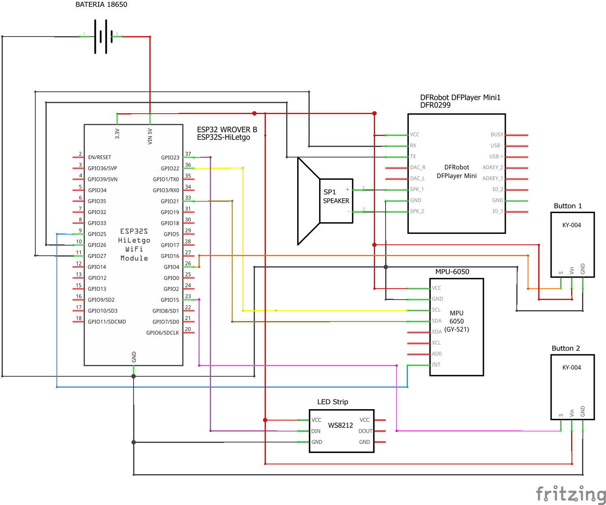
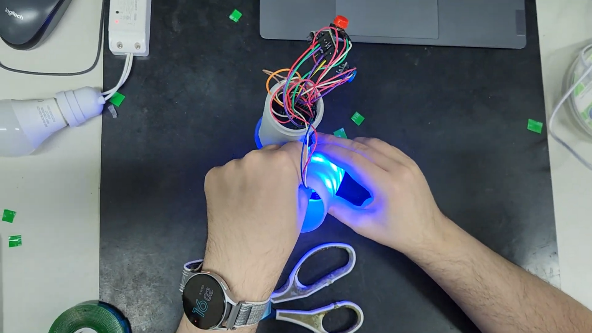

## Description

This project is an ESP32-powered IoT "lightsaber" that uses motion gestures to control smart home devices via MQTT. By recognizing directional swings using a built-in MPU6050 IMU, the device sends specific commands to a server integrated with Home Assistant. You can trigger actions like toggling lights, playing Spotify tracks, or using TTS for weather updates—all with a flick of the wrist. Users can also record and store custom gesture sequences for new automations. Additional features include onboard LED animations, sound effects via DFPlayer Mini, and real-time debugging through WebSerial.

[Web UI repository](https://github.com/DiogoMarassi/ProjetoMicro)

## Showcase

<video src='demo_video.mp4'/>

## Dependencies

### Board select

- **ESP32 Wrover Module**

### Arduino Library Manager

- **OneButton** by Matthias
- **FastLED** by Daniel Garcia
- **MPU6050** by Electronic Cats
- **DFPlayer Mini Mp3 by Makuna** by Michael C. Miller
- **ArduinoJson** by Benoit Blanchon
- **WebSerial** by Ayush Sharma

### Import zip library

- [Async TCP](https://github.com/ESP32Async/AsyncTCP)
- [Async MQTT Client](https://github.com/marvinroger/async-mqtt-client)

### Other tools

- [LittleFS Uploader](https://github.com/earlephilhower/arduino-littlefs-upload)
